# 아름 카고 — 컴포넌트 구조 및 분석

> 기준: Phase 2 셋업 완료 시점 (2026-04-24). Phase 3 UI 구현 전 계획 문서.

---

## 컴포넌트 계층 트리 (Mermaid)

```mermaid
graph TD
  RootLayout["RootLayout (app/layout.tsx)"]
  RootLayout --> SiteHeader["SiteHeader (layout/site-header.tsx)"]
  RootLayout --> Main["main (page slot)"]
  RootLayout --> SiteFooter["SiteFooter (layout/site-footer.tsx)"]

  SiteHeader --> Logo["Logo"]
  SiteHeader --> DesktopNav["DesktopNav (뉴스·채용·소개)"]
  SiteHeader --> SubscribeCTA["SubscribeCTA (Button)"]
  SiteHeader --> MobileDrawer["MobileDrawer"]

  Main --> LandingPage["/ LandingPage"]
  Main --> NewsPage["/news NewsPage"]
  Main --> JobsPage["/jobs JobsPage"]
  Main --> AboutPage["/about AboutPage"]
  Main --> AdminLayout["/admin AdminLayout"]

  LandingPage --> HeroSection["HeroSection"]
  LandingPage --> BentoGrid["BentoGrid"]
  HeroSection --> GradientBlobBg["GradientBlobBg"]
  BentoGrid --> HeroPickCell["HeroPickCell (3×2)"]
  BentoGrid --> NewsStackCell["NewsStackCell (1×2)"]
  BentoGrid --> JobSpotlightCell["JobSpotlightCell ×2"]
  BentoGrid --> MetricCell["MetricCell (1×1)"]
  BentoGrid --> EmailCTACell["EmailCTACell (4×1)"]

  NewsPage --> CategoryChips["NewsCategoryChips"]
  NewsPage --> EditorPickBanner["EditorPickBanner"]
  NewsPage --> NewsCardList["NewsCardList"]
  NewsCardList --> NewsCard["NewsCard"]
  NewsCard --> AviationTerm["AviationTerm (tooltip)"]

  JobsPage --> JobFilters["JobFilters (sidebar/drawer)"]
  JobsPage --> JobCardList["JobCardList"]
  JobCardList --> JobCard["JobCard"]
  JobCard --> DeadlineBadge["DeadlineBadge"]
  JobsPage --> CargoCareerLinks["CargoCareerLinkBlock"]

  AboutPage --> StorySection["StorySection"]
  AboutPage --> ValueProps["ValueProps (3-col)"]
  AboutPage --> CarouselShowcase3D["CarouselShowcase3D"]

  AdminLayout --> AdminDashboard["/admin/dashboard"]
  AdminLayout --> NewsApprovalQueue["/admin/news"]
  AdminLayout --> JobsApprovalQueue["/admin/jobs"]
  AdminDashboard --> MetricCard["AdminMetricCard ×8"]

  SiteFooter --> SubscribeModal["SubscribeModal (global overlay)"]
  SubscribeModal --> SubscribeForm["SubscribeForm"]

  RootLayout --> ToastProvider["ToastProvider (global)"]
  ToastProvider --> Toast["Toast"]
```



---

## 디렉토리 구조

```
src/
  app/
    layout.tsx              ← RootLayout (폰트·메타데이터·lang=ko)
    page.tsx                ← LandingPage
    globals.css             ← arum.* CSS 변수 + Tailwind base
    news/
      page.tsx              ← NewsPage
      [slug]/page.tsx       ← NewsDetailPage (Phase 3)
    jobs/
      page.tsx              ← JobsPage
      [slug]/page.tsx       ← JobDetailPage (Phase 3)
    about/page.tsx
    subscribe/
      verify/page.tsx
      settings/[token]/page.tsx
    unsubscribe/[token]/page.tsx
    privacy/page.tsx
    terms/page.tsx
    admin/
      layout.tsx            ← AdminLayout (Magic Link 미들웨어 보호)
      page.tsx              ← AdminLogin
      dashboard/page.tsx
      news/page.tsx
      jobs/page.tsx
    api/
      news/route.ts         ← 뉴스 ingest API
      jobs/route.ts         ← 채용 ingest API
      subscribe/route.ts
      unsubscribe/route.ts
      cron/digest/route.ts  ← 07:00 KST 다이제스트 크론
      admin/approve/route.ts

  components/
    layout/
      site-header.tsx
      site-footer.tsx
      mobile-drawer.tsx
    news/
      news-card.tsx
      news-category-chips.tsx
      editor-pick-banner.tsx
      aviation-term.tsx       ← 툴팁 컴포넌트
    jobs/
      job-card.tsx
      job-filters.tsx
      deadline-badge.tsx
      cargo-career-links.tsx
    admin/
      admin-metric-card.tsx
      news-approval-row.tsx
      jobs-approval-row.tsx
    ui/                     ← shadcn/ui 컴포넌트
      button.tsx
      (추가 예정: input, dialog, sheet, toast, badge, tooltip, card)

  lib/
    api/
      naver-news.ts         ← 네이버 뉴스 API 클라이언트 (서버사이드 only)
      worknet.ts            ← 워크넷 채용 API
      saramin.ts            ← 사람인 채용 API
      loops.ts              ← Loops.so 이메일 클라이언트
      gemini.ts             ← Gemini 번역 facade
    supabase/
      client.ts             ← 브라우저 클라이언트
      server.ts             ← 서버 클라이언트
    utils/
      slug.ts
      date.ts
      cargo-filter.ts       ← 비카고 직군 EXCLUDE_RE 필터
```

---

## 컴포넌트 설계 원칙

### 재사용 우선순위
| 컴포넌트 | 재사용 범위 | Props 설계 방향 |
|---|---|---|
| `NewsCard` | news 피드 + Bento NewsStack | `article: NewsArticle` 타입 단일 props |
| `JobCard` | jobs 피드 + Bento JobSpotlight | `job: JobPost` 타입 단일 props |
| `AviationTerm` | NewsCard, EditorPickBanner, GlossaryPage | `term: string`, `definition?: string` |
| `DeadlineBadge` | JobCard, JobSpotlight Bento | `deadline: Date` → D-N 자동 계산 |
| `AdminMetricCard` | admin/dashboard ×8 | `title, value, trend, chartData, chartType` |

### 서버/클라이언트 컴포넌트 경계
```
Server Components (기본):
  - NewsPage, JobsPage (데이터 fetch)
  - NewsCard, JobCard (정적 렌더)
  - AdminMetricCard (차트 데이터 서버에서 fetch)

Client Components ('use client' 필요):
  - MobileDrawer (상태: open/close)
  - JobFilters (상태: 필터 값)
  - SubscribeModal (상태: open, 폼 입력)
  - CarouselShowcase3D (Framer Motion)
  - HeroSection (Framer Motion + useScroll)
  - AviationTerm (Tooltip hover 상태)
  - ToastProvider (전역 상태)
```

---

## 현재 상태 및 개선점

### 현재 완료
- `src/components/ui/button.tsx` — shadcn/ui Button (base-ui 기반)
- `src/lib/utils.ts` — `cn()` 유틸리티
- `src/app/layout.tsx` — 폰트·메타데이터·lang 수정 완료
- `tailwind.config.ts` — `arum.*` 토큰 정의

### Phase 3 구현 순서 (권장)
1. `globals.css` — arum.* CSS 변수 완성
2. `SiteHeader` + `SiteFooter` — 레이아웃 셸
3. `HeroSection` — Gradient Blob + Parallax
4. `BentoGrid` — 4×3 그리드 셸 (더미 데이터)
5. `NewsCard` + `NewsPage` — 뉴스 피드
6. `JobCard` + `JobsPage` — 채용 피드
7. `SubscribeModal` — 구독 플로우

### 개선 필요 사항
- `button.tsx`가 `@base-ui/react/button`을 사용 중 — shadcn/ui 표준(`@radix-ui`)과 다름. Phase 3 시작 전 shadcn 컴포넌트 재생성 권장
- `globals.css` — Geist 기본 변수 제거 후 arum.* 변수로 교체 필요
- `app/page.tsx` — 현재 Next.js 기본 템플릿, LandingPage로 전면 교체 필요
